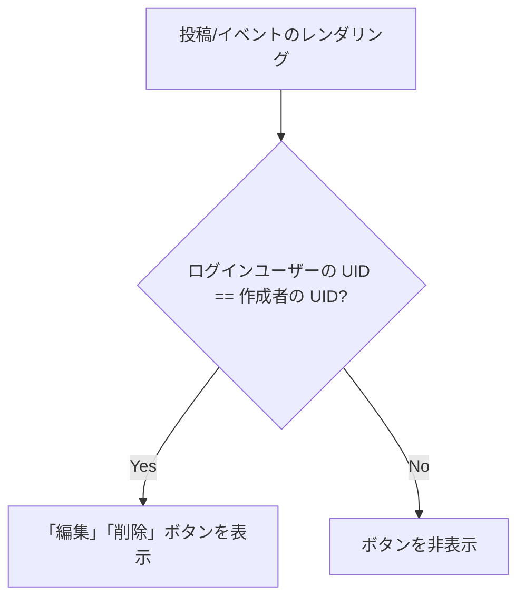

# コメントおよびイベントの編集・削除機能の実装完了

ユーザーが自分が投稿した「コメント」および主催する「イベント」を、後から編集（修正）および削除できる機能を実装しました。
本機能は本番環境（Firestore）およびデモ環境（LocalStorage）の双方で正常に機能します。

## 変更されたファイル

* [index.html](../index.html): 編集・削除UI、コメントインライン編集機能、イベントプレフィル・編集モード処理、削除確認処理、Firestore/LocalStorage更新・削除処理。
* [style.css](../style.css): 編集・削除アクションボタンおよびインライン編集用テキストエリアのスタイリング。
* [tests/e2e_test_edit_delete.js](../tests/e2e_test_edit_delete.js): コメントおよびイベントの編集・削除機能を検証する Puppeteer 自動テストスクリプト。

---

## 主な機能とUIの紹介

### 1. 権限制御
- ログイン中のユーザーの `uid` を、投稿データおよびイベントデータの作成者 `uid` (`creatorUid`) と比較します。
- 一致した本人のみに「✏️ 編集」「🗑️ 削除」ボタンがカードヘッダー右側に表示されます。



### 2. コメントのインライン修正
- 「編集」ボタンを押すと、カード内のメッセージ本文がそのまま入力テキストエリアに切り替わり、その場で直感的に内容を修正できます。

### 3. 削除時の誤操作防止
- 削除ボタンを押した際は、ブラウザ標準の確認ダイアログが表示され、誤操作を防ぎます。
- コメントを削除すると、親コメントに関連付けられている返信（子メッセージ）も同時に一括削除されます。

---

## 動作確認スクリーンショット（テスト経過）

テスト中に記録された各フェーズの画面表示推移です。

````carousel

<!-- slide -->

<!-- slide -->

<!-- slide -->

<!-- slide -->

<!-- slide -->

````

---

## テスト実行結果

作成したE2Eテストを実行し、すべてのケースが期待通りに動作して無事成功したことを確認しました。

```
Navigating to target page...
Logging in with demo credentials...
Creating a new post...
Verifying post creation...
Screenshot 13 saved.
Checking edit and delete buttons on the post...
Clicking edit button...
Updating post content...
Post content successfully updated!
Screenshot 14 saved.
Deleting the post...
Dialog message: このコメントを削除してもよろしいですか？
Post successfully deleted!
Screenshot 15 saved.
Switching to Events Tab...
Creating a new event...
Screenshot 16 saved.
Clicking event edit button...
Updating event name...
Event successfully updated!
Screenshot 17 saved.
Deleting the event...
Dialog message: このイベントを削除（キャンセル）しますか？
Event successfully deleted!
Screenshot 18 saved.
E2E edit/delete test run finished successfully!
```
