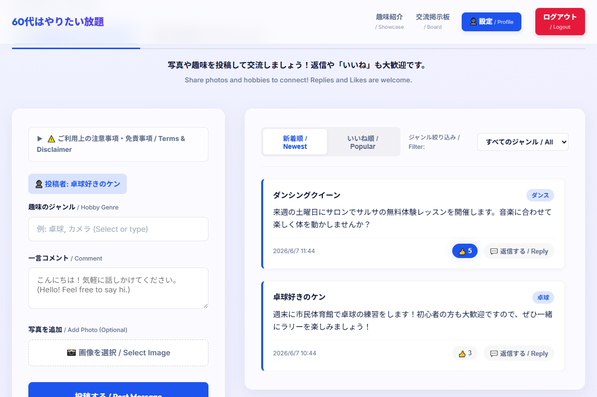
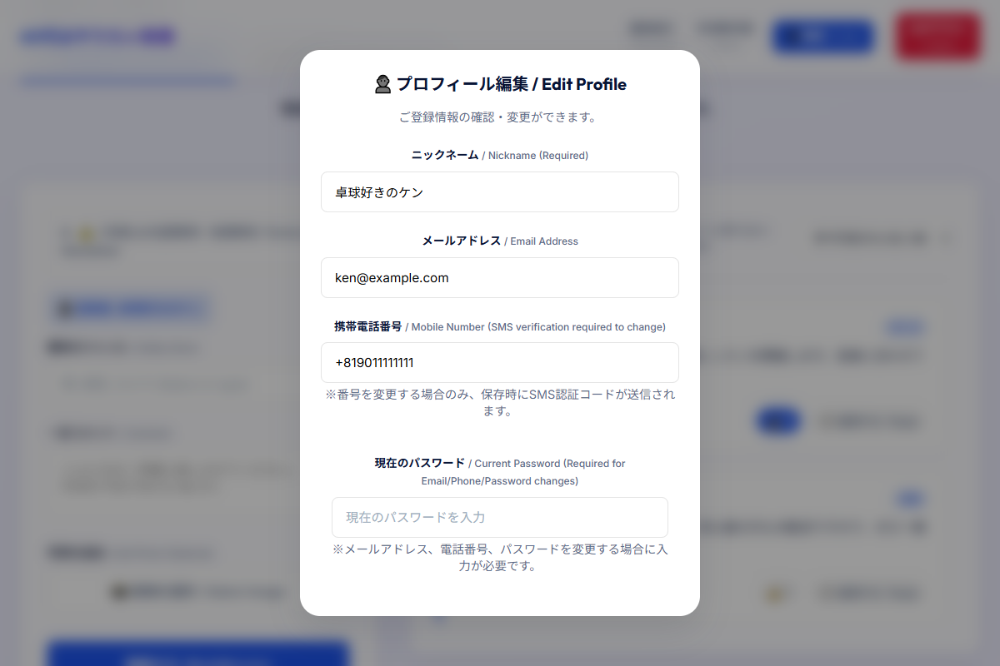
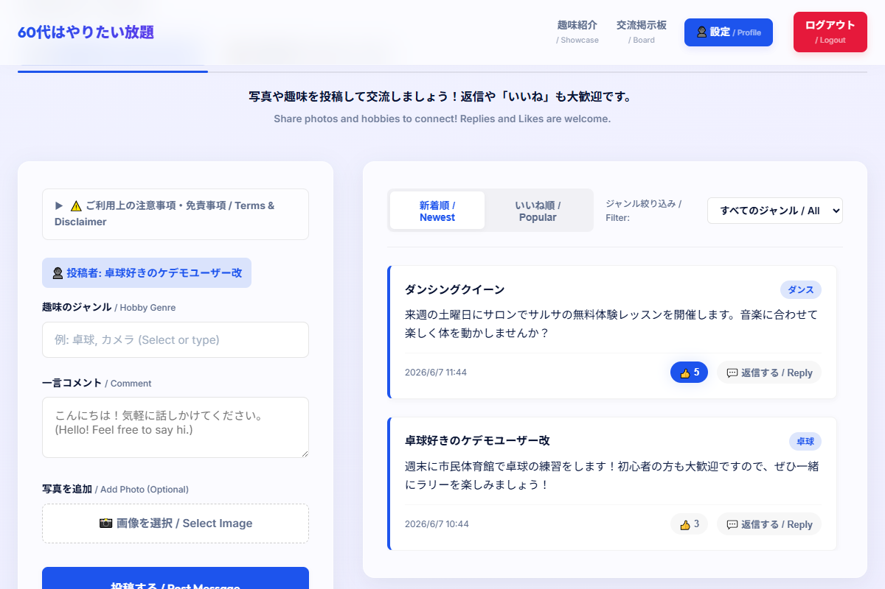
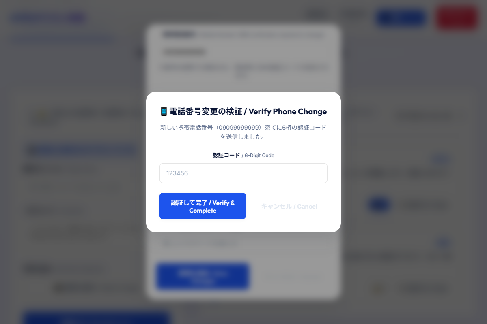
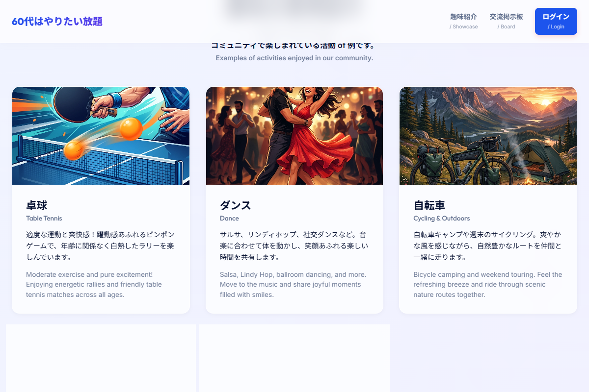
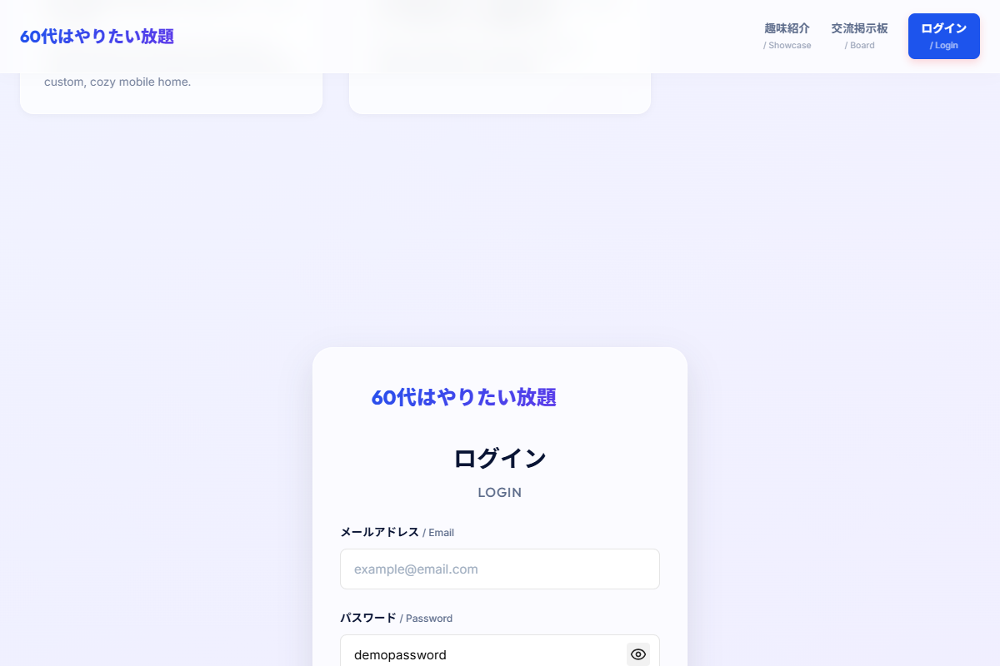
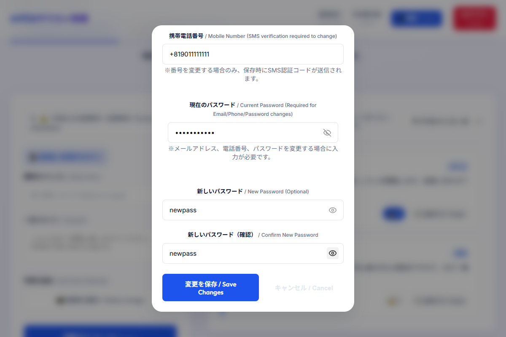
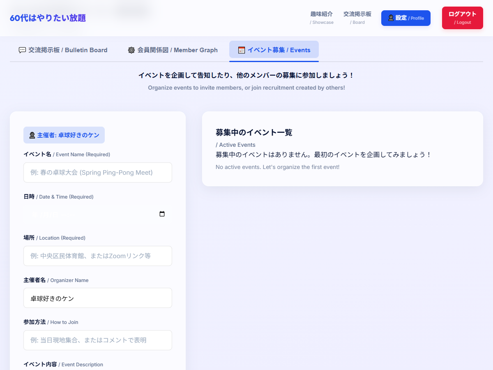
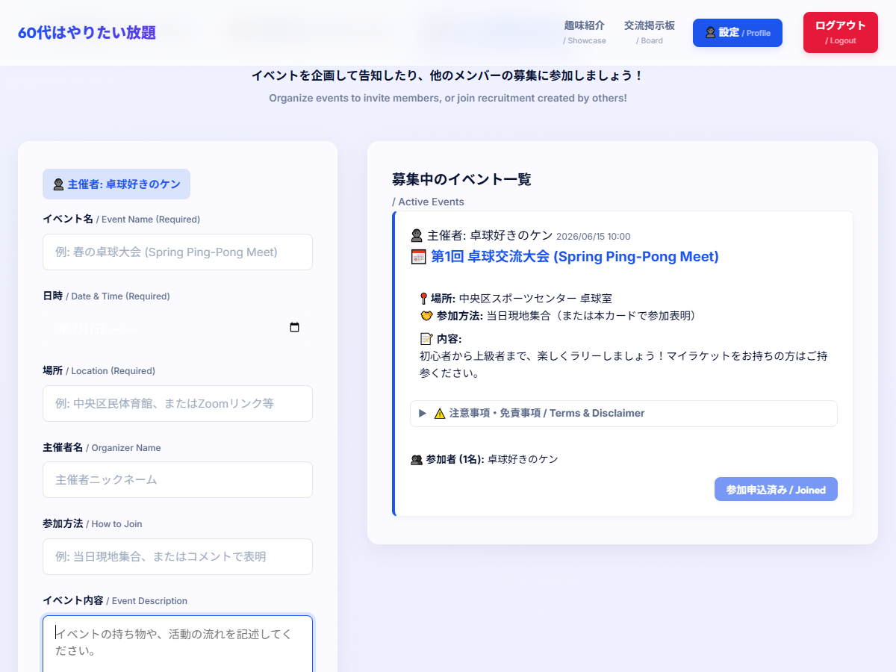
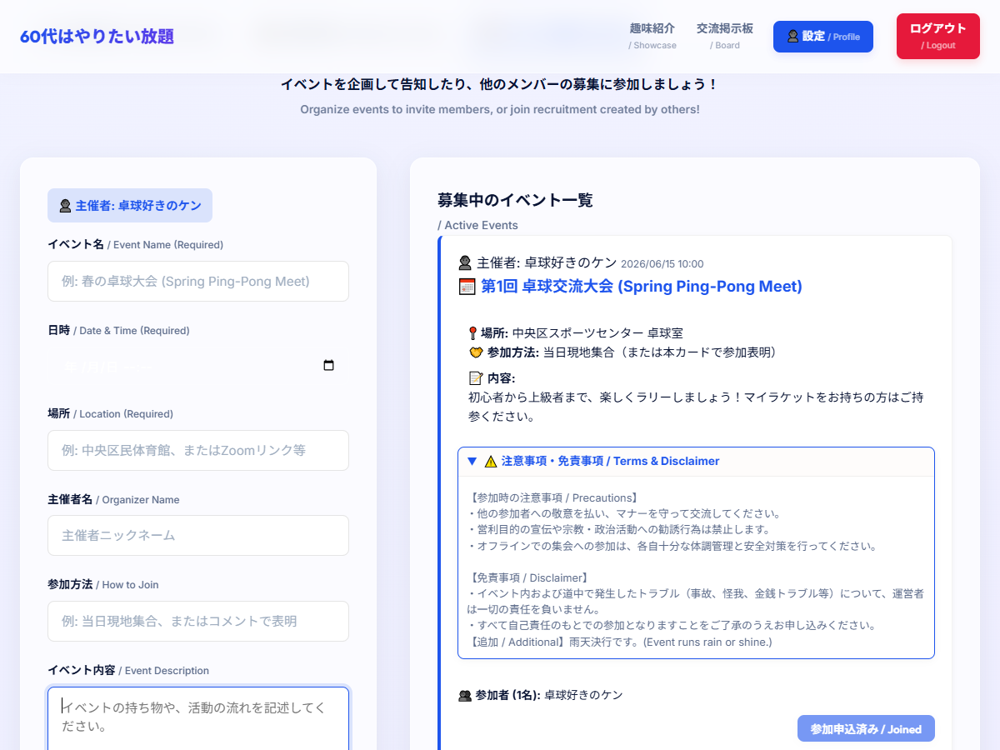

# 実装完了レポート（Walkthrough）

ログイン中の会員が自身の登録情報を確認・変更できる「プロフィール編集画面（マイページ）」、それに伴う認証（再認証・SMS検証）フロー、画面全体への即時反映処理、およびすべてのパスワード入力フィールドに対する「表示・非表示切替トグル（目アイコン）」機能の実装と検証がすべて完了しました。

---

## 変更内容のまとめ

### 1. プロフィール編集モーダル（マイページ）の新設
* 投稿フォームのデザイン（角丸入力フィールド、青色のアクセント、日英併記のラベルなど）を踏襲した、すりガラス調（グラスモーフィズム）の美しいモーダルダイアログ（`#profileModal`）を `index.html` に追加しました。
* **表示項目**:
  - ニックネーム（必須）
  - メールアドレス（必須）
  - 携帯電話番号（変更時はSMS認証が必要）
  - 現在のパスワード（メール・電話番号・パスワード変更時に必須）
  - 新しいパスワード / 新しいパスワード（確認）（任意）
* **レスポンシブ対応 (`style.css`)**:
  - モバイルの縦長画面でも崩れずボタンが押しやすいよう、最大高さを `85vh` に制限して縦スクロール可能（`overflow-y: auto`）にし、パディングやアクションボタンを縦並びに自動調整するレスポンシブスタイルを適用しました。

### 2. アクセス導線の追加
* ログイン成功時のみヘッダーナビゲーションに表示される「👤 設定 / Profile」ボタン（`#profileNavBtn`）を追加しました。
* 掲示板投稿フォームにある「👤 投稿者: 〇〇」のバッジ（`#authUserBadge`）にホバー効果とポインターカーソルを適用し、クリック時にプロフィール編集モーダルが開くようにしました。

### 3. セキュリティ強化（再認証とSMS検証）
* **現在のパスワードによる再認証**:
  - メールアドレス、携帯電話番号、新しいパスワードのいずれかを変更する場合、セキュリティのため「現在のパスワード」の入力を必須とし、Firebase Auth で `reauthenticateWithCredential`（モック環境では登録パスワードの一致確認）を実行するロジックを実装しました。
* **携帯電話番号変更時のSMS再認証**:
  - 携帯電話番号を変更した際、一時的に変更データを保持したまま新しい番号宛てに6桁の検証コードを送信します。
  - 新設した「電話番号変更の検証モーダル」（`#profileSmsModal`）にて、正しいコード（モック用: `123456`、本番: Firebase PhoneAuthProvider による実際のSMS）を入力して認証に成功した場合のみ、電話番号が最終的に書き換わる安全な仕組みを導入しました。

### 4. ニックネーム変更時の即時反映（伝播処理）
* ユーザーがニックネームを変更して保存した際、以下の箇所の表示が即時に更新・再描画されます。
  1. 掲示板フォーム上部の投稿者バッジ（`#boardUserNickname`）のテキスト
  2. タイムラインに並んでいる、過去にそのユーザー（`uid`）が投稿したすべてのメッセージ of 投稿者名
  3. 会員関係図（ネットワークグラフ）の自分自身のノードラベル名
* **データベース同期**:
  - **モックモード**: `localStorage` に保存されている `mock_posts` から該当 `uid` の投稿を一括で書き換えて再ロード。
  - **本番モード**: Firestore の `posts` コレクションに対して `query` + `where` で該当投稿を全取得し、Firestore の `writeBatch` を用いて一括更新コミットを実行します。

### 5. パスワード入力フィールドの表示・非表示切替トグル（目アイコン）
* 既存のすべてのパスワード入力フィールド（ログイン画面、新規会員登録画面、プロフィール編集画面の現在のパスワード・新しいパスワード・確認用パスワードの計5箇所）に切り替えボタンを追加しました。
* **UI/UXデザインとコントラスト調整**:
  - パスワード入力欄の右端の内側にインラインで配置し、既存の角丸フォームのデザイン世界観を壊さないように実装しました。
  - デフォルト（非表示/伏字状態）では「斜線が入った目のアイコン（`eye-off`）」、クリックして表示状態にした際は「開いた目のアイコン（`eye`）」が表示されます。
  - 全ての画面（ログイン、新規登録、プロフィール編集）におけるパスワード入力フィールドは白（または薄いグレー）背景であるため、トグルボタンのデフォルトカラーを明瞭なダークグレー（`rgba(0, 0, 0, 0.4)`、ホバー時は `rgba(0, 0, 0, 0.85)`）に統一し、十分なコントラスト比を確保しました。これにより、どの画面のどの入力欄でも目アイコンがはっきりと視認できるようになりました。
* **アクセシビリティ対応**:
  - トグルボタンには `aria-label` 属性および `title` 属性（「パスワードを表示する」⇄「パスワードを非表示にする」）を付与し、状態の切り替えに合わせて動的に更新します。
  - キーボードの `Tab` キーでフォーカスを合わせることができ、フォーカス状態で `Space` または `Enter` キーを押すことでも切り替えが行えるように実装しました。

---

## E2E自動動作検証結果

Puppeteer-core を利用した E2E 自動テストスクリプト（`e2e_test.js` および `e2e_test_password_toggle.js`）を実行し、すべての動作が正常であることを確認しました。

### 1. ログイン完了後のダッシュボード表示
* テストユーザー `ken@example.com` でログインし、掲示板およびネットワーク関係図が正常にロードされることを確認しました。
* 

### 2. プロフィール編集モーダルの起動
* ヘッダーの「設定」ボタンをクリックし、ニックネームやメールアドレスがフォーム内にプレフィルされることを確認しました。
* 

### 3. ニックネームの変更と即時反映
* ニックネームを書き換えて保存すると、投稿者バッジおよび過去投稿の投稿者名が即座に同期されることを確認しました。
* 

### 4. 携帯番号の変更とSMS検証モーダルの起動
* 携帯電話番号を変更し、現在のパスワードを入力して保存すると、SMSコード入力用のダイアログが起動することを確認しました。
* 

### 5. SMSコードの検証と保存完了
* 6桁の認証コード `123456` を入力して「認証して完了」をクリックし、検証成功後にメッセージが表示されモーダルが閉じることを確認しました。
* 

### 6. 保存結果の最終確認
* 三度プロフィールモーダルを開き、携帯電話番号が最終的に `09099999999` へと正しく更新され保存されていることを確認しました。
* 

### 7. パスワード表示トグル（非表示状態）
* ログイン画面の初期ロード時にパスワードを入力すると伏字（`••••••`）になり、右側に「斜線付きの目のアイコン」が十分なコントラストで表示されていることを確認しました。
* 

### 8. パスワード表示トグル（表示状態）
* トグルボタンをクリックすると入力した文字列（`demopassword`）が平文化されて可視化され、アイコンが「開いた目のアイコン」に変化することを確認しました。
* 

### 9. マイページ内の複数パスワードトグル動作
* プロフィール編集モーダル内の「現在のパスワード」「新しいパスワード」「新しいパスワード（確認）」でもトグルボタンが正常に配置され、クリックによって個別に表示・非表示が切り替わり、目のアイコンが濃い目のグレーではっきりと表示されていることを確認しました。
* 

---

## イベント作成・告知機能（イベント募集）の追加

会員制スペース内に新しく「📅 イベント募集 / Events」タブを新設し、主催者がイベントを企画・告知できる「イベント作成機能」を追加しました。

### 1. 画面仕様とフォームの実装
* **新タブ of 追加**: 「みんなの交流スペース」のタブに「📅 イベント募集 / Events」タブ（`#tabBtnEvents`）を追加し、作成フォームと募集イベント一覧タイムラインを表示させました。
* **作成フォーム**:
  - **主催者ニックネームの自動表示**: ログインユーザーのニックネームが「主催者」バッジに自動表示され、フォーム内にもプレフィルされるようにしました（変更可能）。
  - **入力項目**: イベント名、日時（`datetime-local`）、場所、参加方法、イベント内容、注意事項・免責事項（初期ひな型挿入、編集可能）。
* **注意事項・免責事項テンプレート**:
  - フォームの初期値として、標準的なイベント参加上の誓約事項・自己責任の原則・免責事項のひな型が自動セットされるようにしました。

### 2. タイムライン表示と参加機能
* **イベントカード表示**:
  - イベント名、日時（フォーマット済）、場所、参加方法、内容、そしてアコーディオン（`
`）で折りたたまれた「注意事項・免責事項」を表示します。
  - 参加者リストを表示し、何名が参加しているかを一目でわかるようにしました。
* **イベントへの参加表明**:
  - 「参加を申し込む / Join Event」ボタンを設置しました。
  - 主催者は作成時に自動的に参加者リストに追加されます。また、他のユーザーがログインしてクリックした場合は、ボタンが「参加申込済み / Joined」となり非活性化されます。

### 3. E2E自動動作検証結果
Puppeteer を使った E2E テスト（`e2e_test_events.js`）を実行し、以下の動作が正常であることを確認しました。

#### 10. イベント募集タブの初期ロード
* ログイン後にイベントタブへ切り替えた時の初期状態。主催者名やひな型がセットされたフォームがロードされます。
* 

#### 11. イベントの新規作成完了
* フォームを入力して「イベントを作成する」をクリックし、タイムラインにイベントカードが追加され、主催者が自動で「参加」となっている状態。
* 

#### 12. 注意事項アコーディオンの開閉
* イベントカード内の「注意事項・免責事項」の折りたたみがクリックによって正常に開き、編集された注意事項が正しく確認できる状態。
* 

---

## キャッシュの消去と動作確認

今回の変更は JavaScript ロジックの追加および CSS の更新に基づいています。
ご自身のブラウザで動作確認をされる際は、念のためシークレットウィンドウを開くか、またはブラウザのデベロッパーツールを開いて「キャッシュの消去とハード再読み込み」を行った上で、URL末尾に `?mock=true&v=fix_verified_2` を付けてご確認ください。
