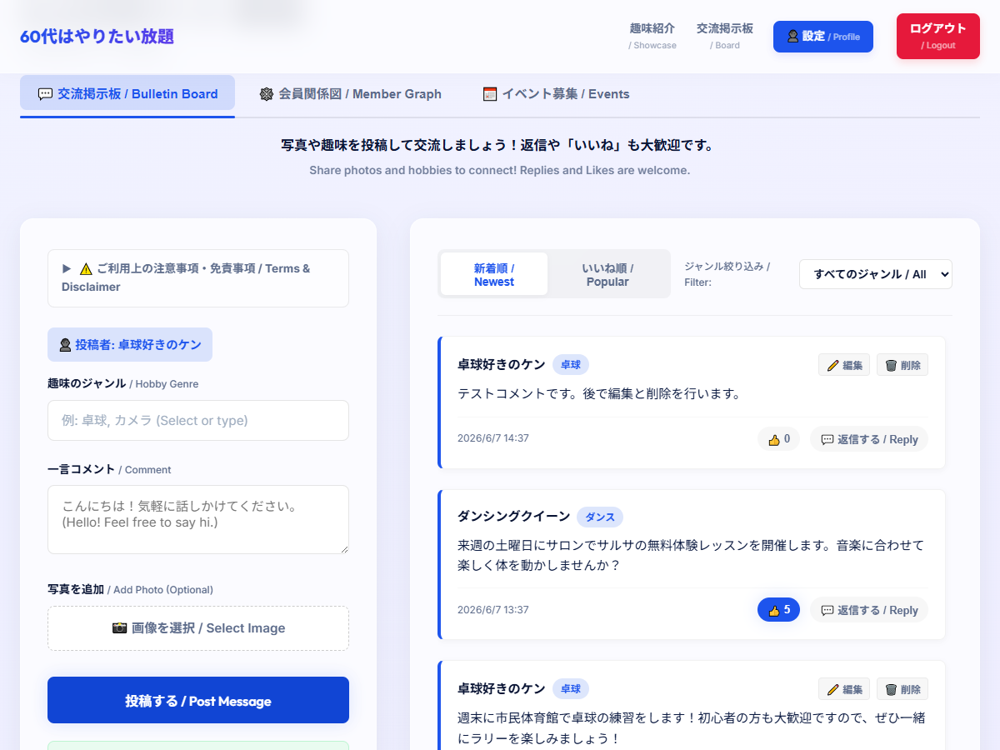
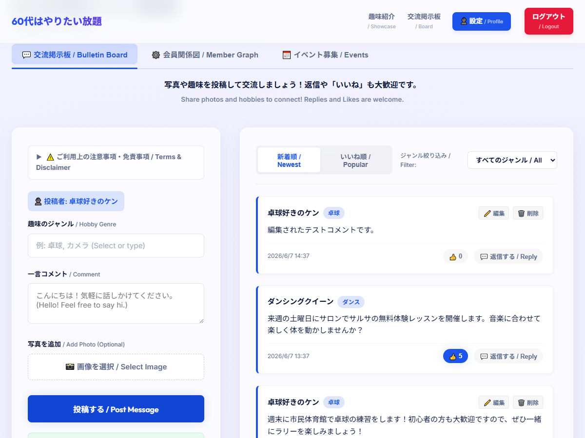
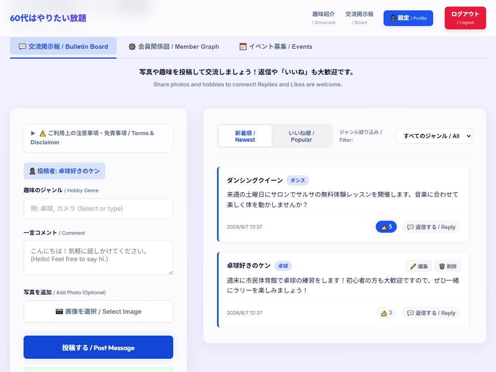
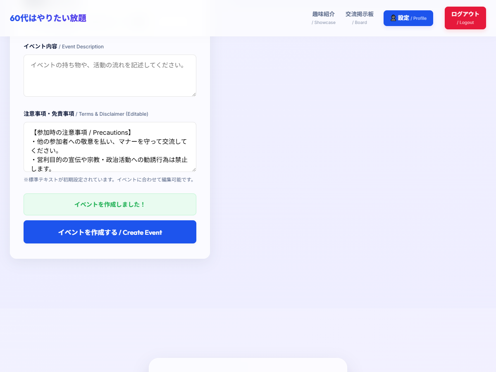
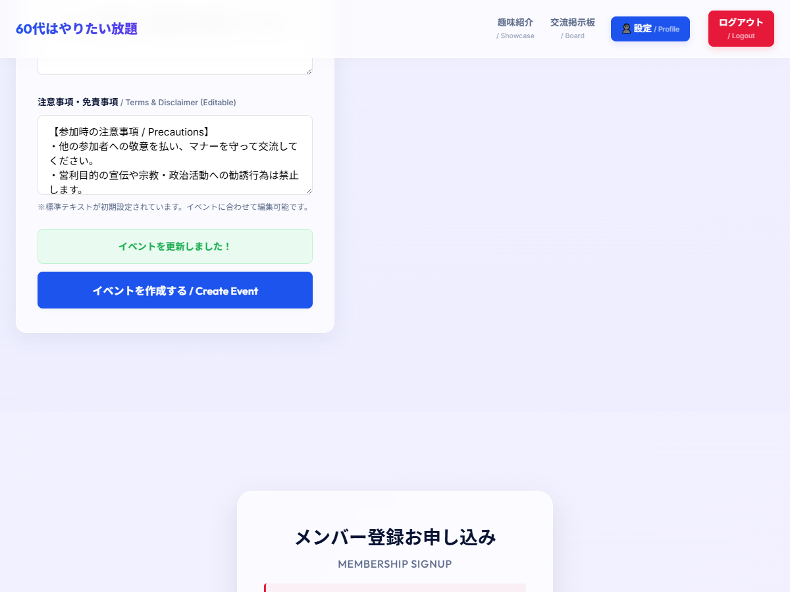
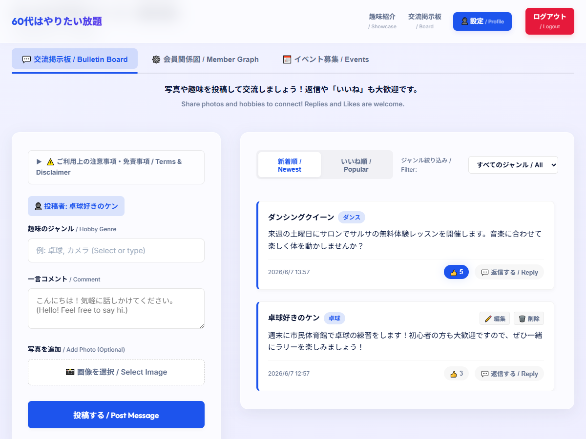
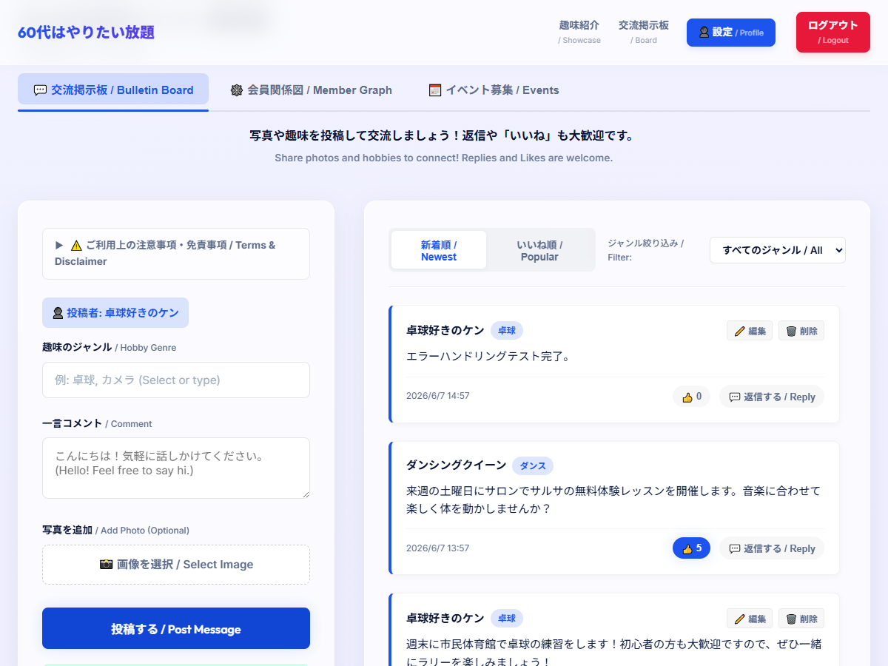

# 投稿・返信処理のフリーズ解消および編集・削除機能の実装完了

交流スペースにおける「コメント」および主催する「イベント」の編集・削除機能の実装と、大容量ファイル投稿時等に発生していた「投稿中... / Posting...」のままフリーズするバグの解消を行いました。

## 変更されたファイル

* [index.html](../index.html):
  - 編集・削除UIの追加とそれに伴う更新・削除API呼び出し処理の実装。
  - 各種非同期処理（モック用の `setTimeout` コールバック）内への `try-catch-finally` による例外ハンドリングの追加。
  - モック動作時における画像アップロード容量上限の `1MB` 制限と、LocalStorage容量制限超過時の警告表示によるフリーズ防止。
* [style.css](../style.css): 編集・削除アクションボタンおよびインライン編集用テキストエリアのスタイリング。
* [tests/e2e_test_edit_delete.js](../tests/e2e_test_edit_delete.js): コメントおよびイベントの編集・削除機能を検証する Puppeteer 自動テストスクリプト。
* [tests/e2e_test_error_handling.js](../tests/e2e_test_error_handling.js): 許容量超過画像のアップロード検知時のアラート警告、およびエラー発生後のローディング解除・ボタン復旧を検証する自動テストスクリプト。

---

## 修正された不具合（通信・ローディングフリーズ）の概要

### 従来の挙動と原因
- 非同期（モックLocalStorageへの書き込みなど）処理の中で、画像容量超過等により `QuotaExceededError` が発生した際、非同期コールバック内部にエラーハンドリング（`try-catch-finally`）がなかったため、処理が途中で例外終了していました。
- これにより、送信ボタンの非活性状態を戻すローディング解除処理までコードが到達せず、「投稿中...」のスピナーが回り続けたまま画面操作がフリーズしていました。

### 対策
1. 非同期モック処理のすべてを `try-catch-finally` で囲み、エラー発生時にも確実に活性状態へ復帰するようにしました。
2. モックでの大容量画像保存によるLocalStorageパンクを防ぐため、モック利用時のファイルサイズ制限を `1MB` に引き下げました。
3. 容量制限に達した際には、フリーズせずにユーザーに「容量が大きすぎます」というわかりやすいエラー警告を表示するハンドリングを追加しました。

---

## 動作確認スクリーンショット（テスト経過）

テスト中に記録された各フェーズの画面表示推移です。

````carousel

<!-- slide -->

<!-- slide -->

<!-- slide -->

<!-- slide -->

<!-- slide -->

<!-- slide -->

<!-- slide -->

````

---

## テスト実行結果

### 1. エラーハンドリング・容量制限テスト (`e2e_test_error_handling.js`)
巨大なダミーデータ（1.5MB）を用いて、警告ダイアログの検知、およびエラー発生後でもフリーズせずにボタンが即座に復帰し、次の投稿（テキストのみ等）を正しく完了できることを検証しました。

```
Generated a 1.5MB dummy file at: C:\Users\user\.antigravity-ide\tests\dummy_large_image.png
Navigating to target page...
Logging in...
Uploading a 1.5MB file to trigger mock limit alert...
[ALERT DETECTED] message: "画像サイズは1MB以下にしてください。(Image size must be 1MB or less)"
Screenshot 19 saved.
Mock size limit alert correctly triggered!
Posting text message to verify standard posting & button restoration...
Waiting for posting response message...
Screenshot 20 saved.
Submit button correctly re-enabled and spinner hidden!
Timeline successfully updated!
Dummy file cleaned up.
E2E error handling test run finished successfully!
```

### 2. 編集・削除機能テスト (`e2e_test_edit_delete.js`)
自分が作成したコンテンツのみに「編集」「削除」ボタンが表示され、インライン編集および削除がタイムラインやイベント一覧に正しく同期されることを検証しました。

```
Navigating to target page...
Logging in with demo credentials...
Creating a new post...
Verifying post creation...
Screenshot 13 saved.
Checking edit and delete buttons on the post...
Clicking edit button...
Updating post content...
Post content successfully updated!
Screenshot 14 saved.
Deleting the post...
Dialog message: このコメントを削除してもよろしいですか？
Post successfully deleted!
Screenshot 15 saved.
Switching to Events Tab...
Creating a new event...
Screenshot 16 saved.
Clicking event edit button...
Updating event name...
Event successfully updated!
Screenshot 17 saved.
Deleting the event...
Dialog message: このイベントを削除（キャンセル）しますか？
Event successfully deleted!
Screenshot 18 saved.
E2E edit/delete test run finished successfully!
```
